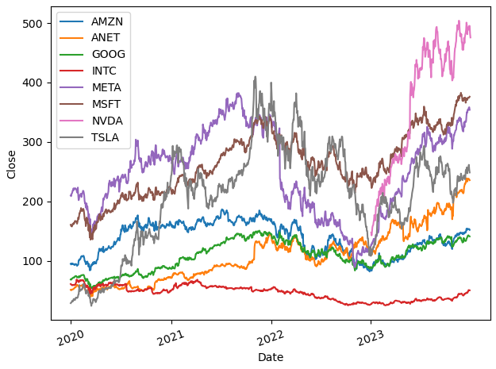
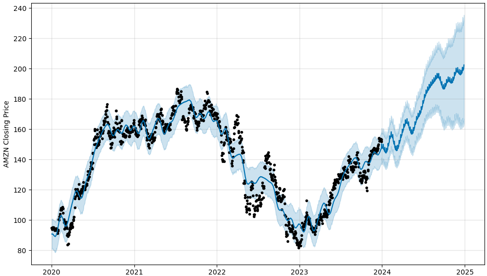
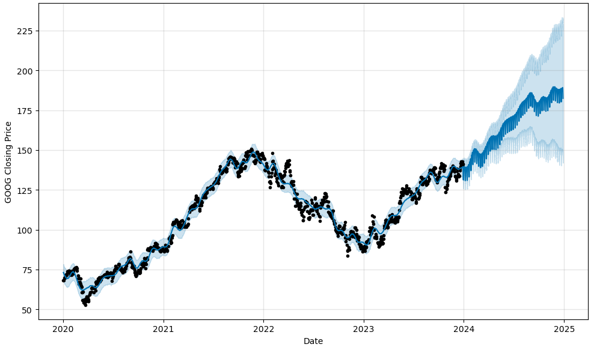
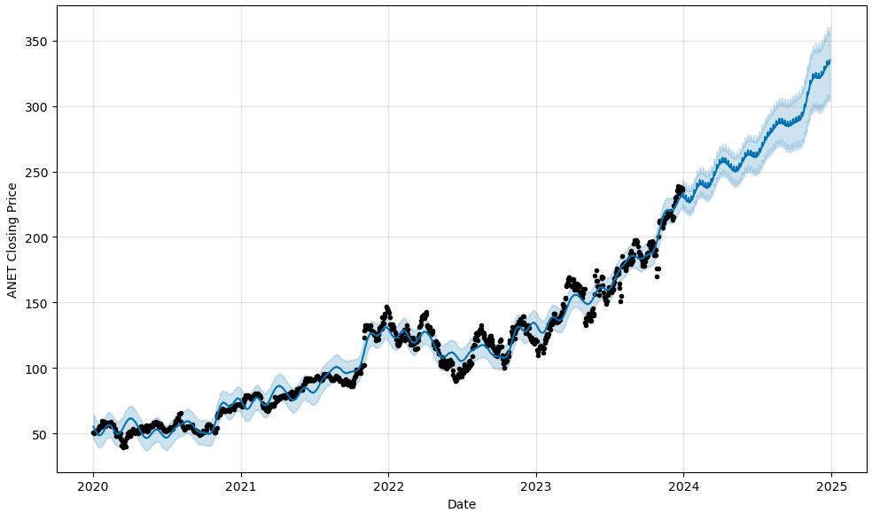
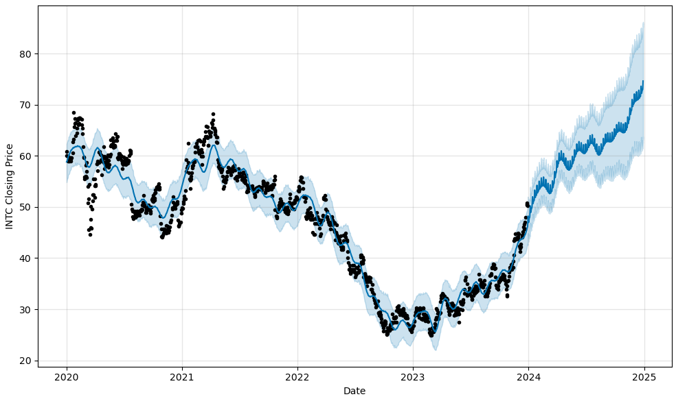
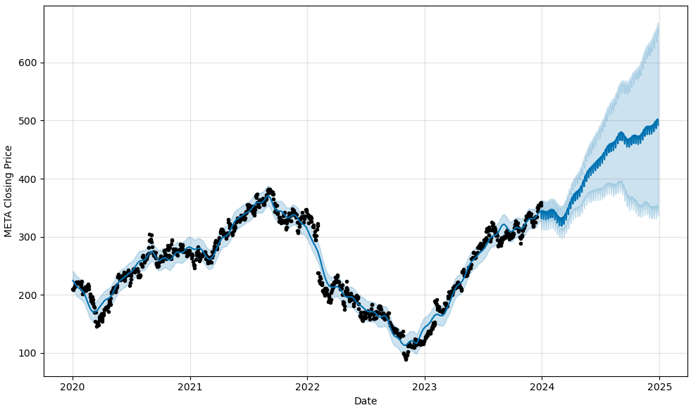
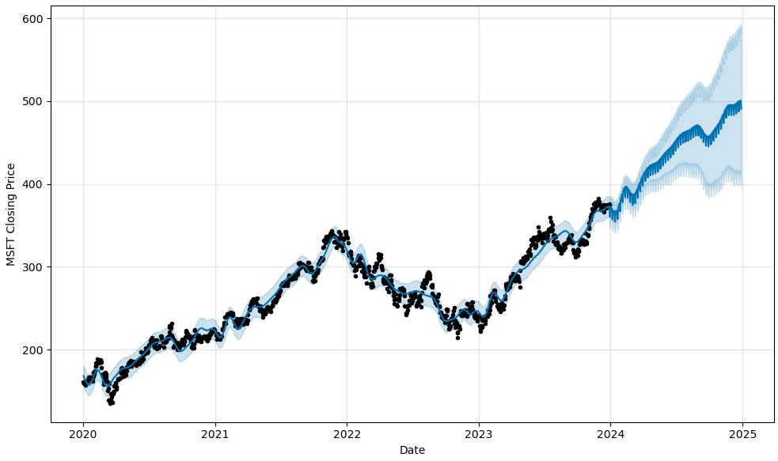
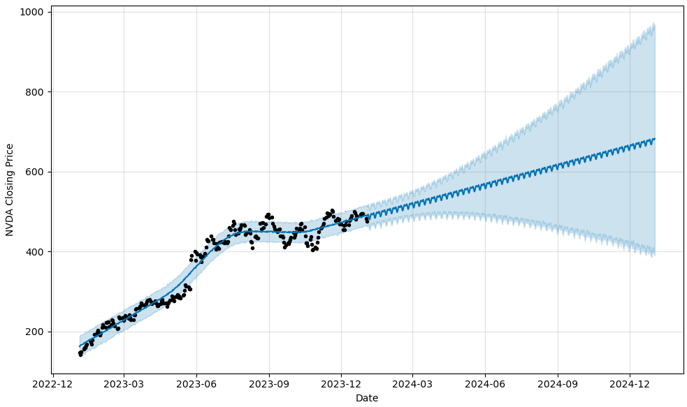
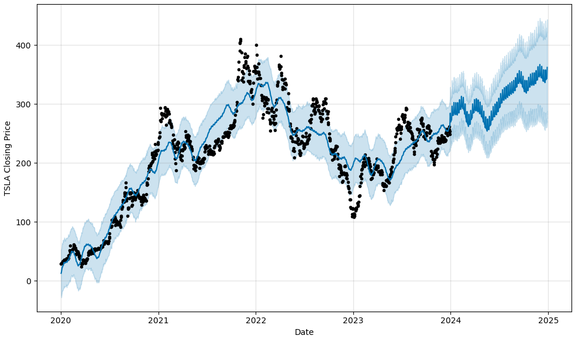

# project1-varos-kiluvia-conley-melton

For Project 1, you will work with your group to find and analyze a dataset of your choice.
For this project, you can focus your efforts within a specific industry, as detailed in the following examples.

# Executive Summary
- The purpose of the project was to identify eight (8) companies stock who had an AI focus and review their performance during the 2020 - 2023 performance years influenced by the Covid pandemic.  This information provided historical data to make a prediction using Prophet and determine year end closing prices for 2025.  2024 year end closing prices were also identified for all companies to determine an endpoint reference.  It should be noted all companies maintained original business objectives which included a focus on non AI factors as well as prepandemic product lines.  These factors may influence a higher comparative stock price for companies with broader business objectives than others.  It was concluded NVDA not only had the highest closing stock price but the highest future closing price for 2025 while GOOG had the lowest closing stock price and lowest future price for 2025.

# Data Collection
- First looked to NASDAQ API. Albeit free data sets, this source requires an account.
- Secondly looked at Google Finance. Data is free, but this source requires the use of Google Sheets.
- Lastly, looked at and decided to use Yahoo Finance. The data is free and is downloaded as csv files.
- Data Collection was obtained from https://finance.yahoo.com.
- Reference research was obtained in Appencicies of Readme.md.

# Cleanup
- Cleanup was achieved by originally plotting all companies together and then plotting individually to determine if each company contained sufficient data to include in the analysis.

# Approach
- The group approached its objective by obtaining a clean and functional dataset.  This was found on Yahoo Finance.  Data was obtained by accessing the dataset for each company with an AI focus and establishing a date and time stamp.  All record sets contained identical formatting which was used to incorporate data into analysis and determine closing price.  Data was then plotted for visual determination.

# Future Development
- Future development includes the identification of price range during the 2020 - 2024 timeframe and the average fluctation of stock prices.  Highest percentage gains should be determined from initial 2020 price to closing of 2025.  Recommendations should be made to determine which stock to purchase for maximum profit in 2025.

# Scope/Project Overview
-  An agile project was set up using GitHub Projects to get the group started and establish a proper focus.
-  The focus resulted in an analysis of the financial stock market.
-  The group chose 8 companies who had an Artificial Intelligence focus during the primary Covid years 2020-2023.
-  The companies stock was analyzed to see how they perform during this time and forcast using Prophet to determine performance through 2024-2025.
-  Historical data was used to predict how the companies may perform in the future.
-  Companies chosen were NVidia, Intel, Microsoft, Tesla, Amazon, Alphabet Inc, Arista Networks Inc, Meta
-  The group met regulary during class hours as well as worked individually during off hours to ensure all milestones were met and a timeline maintained.

# Specifically what questions were we wanting to answer????

# Software Version Control
- A GitHub repository was created.  All group members contributed to respsitory.
- Each GitHub commit was annotated to ensure proper communication between group members.
- Supporting files were also uploaded and evaluated by the group.

# Documentation
- Relevant notes have been included with all code as well as the Readme.md.
- There are no installation requirements.
- The Readme.md file contains graphical representation of the research findings.

# Analysis and Conclusion - Results
- Analysis shows the listed companies indicated the highest closing prices during 2020-2023 time periods in the following order.
- NVDA $450 Projected - $700
- MSFT $375 Projected - $500
- META $350 Projected - $500
- TSLA $250 Projected - $350
- ANET $240 Projected - $340
- AMZN $155 Projected - $205
- GOOG $140 Projected - $190
- INTC $50  Projected - $75

# Findings and Implications
- The findings indicate NVDA had the highest closing prices with the largest growth in closing dollar amount for 2025.
- The findings indicate GOOG had the lowest closing prices with the smallest growth in closing dollar amount for 2025.
- INTC did not contain enough data for a comparative analysis resulting in a small scrubbing or cleaning of data.
- All companies had an Artificial Intelligence focus while still maintaining pre AI and pre Covid business objectives.

# Based on the code, how did we arrive at our figures????  What Statistical Analysis was used?

## Companies Projections

## Amazon Projection

## Google Projection

## Arista Networks Inc Projection

## Intel Corporation Projection

## META Projection

## Microsoft Projection

## NVIDIA Projection

## TESLA Projection

## Appendix (Resources)
- https://finance.yahoo.com/
- https://money.usnews.com/investing/articles/artificial-intelligence-stocks-the-10-best-ai-companies
- https://builtin.com/artificial-intelligence/publicly-traded-ai-companies
- https://greenstocknews.com/stocks/artificial-intelligence-stocks 

